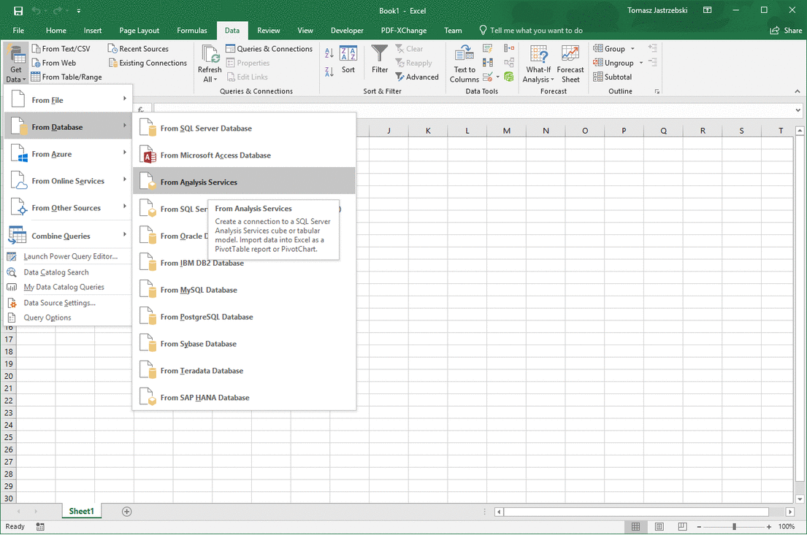
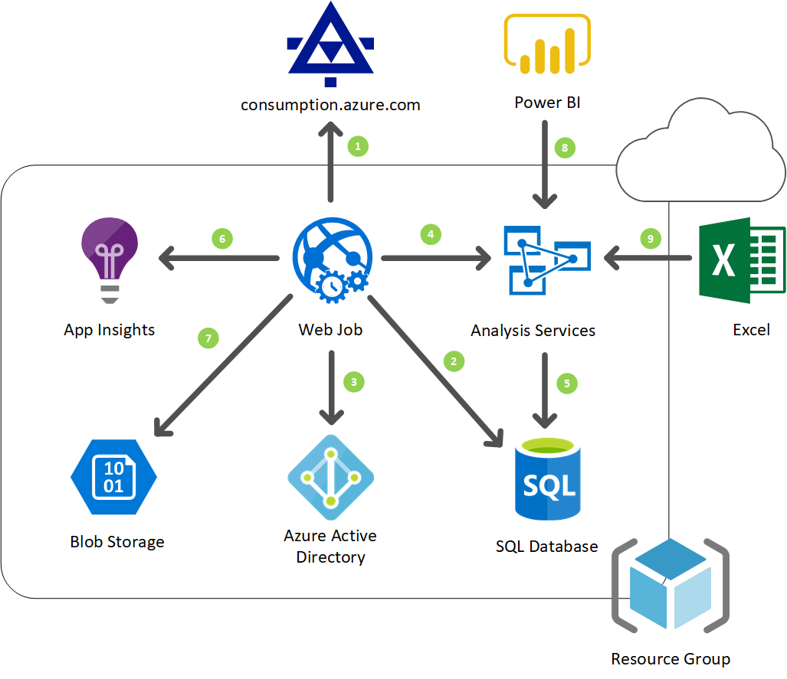

# Azure Enterprise Usage Reports (AER)
This software solution allows for retrieving, storing and analyzing Azure enterprise usage data along with resource Tags.

## Solution Description
* This software solution allows for retrieving, storing and analyzing Azure enterprise usage data along with resource Tags.
* The solution is designed to be hosted in Azure and consists of three main components:
  * WebJob as ETL engine
  * SQL Server database providing raw data store
  * Azure Analysis Services (AAS) as hierarchical, aggregated data store
* Reports, typically in Excel or Power BI, using AAS as a data source, return truly lightspeed results.
* The solution has been optimized to store and process millions of usage records.
* The solution is dedicated to enterprises, rather than individual subscription owners. Enterprise account is required.

## Architecture and Process Flow
1. Web Job retrieves Azure usage records from Reporting APIs for Enterprise customers.
2. Retrieved records are stored in Azure SQL Server staging table. Once committed, SQL Server table indexes are defragmented. Database connection uses **aer-writer** user credentials.
3. Service Principal token is obtained from Azure Active Directory (AAD).
4. Azure Analysis Services (AAS) processing is triggered using Service Principal token obtained in the previous step.
5. During processing AAS pulls data from SQL Server using SQL Server authentication to connect **aer-reader** user credentials.
6. Trace data is written to App Insights.
7. WebJob state is written to BlobStorage.
8. AAS Database is accessed from Power BI.
9. AAS Database is accessed from Excel.

## Capacity
The solution has been verified to perform well with over 10 millions of records.
* Azure Analysis Services (AAS) database consumes about 100MB of space per each million of records.
* Azure SQL Server database consumes about 1GB per each million of records.

## Challenges Encountered
1. Data available via webservice is not always 100% consistent. Some examples:

  * inconsistent casing (Location, ResourceGroup, InstanceId),
  * same MeterId used for meters with different names, categories and subcategories,
  * missing or incomplete InstanceId,
  * ConsumedService field is often blank but appears as a part of InstanceId.

To circumvent the above inconsistencies, additional data transformations had to be implemented.

2. It has not been figured out how to eliminate SQL Server authentication and use Service Principal only instead. It is easy to connect to AAS or SQL Server using Service Principal but it has not been determined how to force AAS to use Service Principal to pull data during database processing (delegate permissions). It may prove to be impossible since Service Principal tokens are issued for a particular resource. It has been decided not to use Service Principal for purposes other than connecting to AAS, as complete elimination of SQL Server authentication has proved to be impossible.
3. WebJobs SDK: the solution uses the latest SDK version 3.0. This version has introduced many breaking changes and is not well documented. Typically, introduction of major changes with no sufficient documentation is Microsoft&#39;s gentle suggestion to migrate to other technology - Azure Functions in this case. However, Azure Functions cannot be used yet.
4. AAS authentication: it seems Administrator role is required to programmatically connect to AAS or even just list available databases.
5. AAS tools quality: however great and stable AAS can be, it somehow lacks first class support when it comes to VS extensions, SSDT or data access assemblies. An example: until the version 2.6 of extension,  adding service principal to any role caused exception. This worked in SSMS but then data source credentials did not get saved. There is no option to change data source name, which includes initially selected server name and could be misleading. These are just random examples.
6. Deployment of AAS using &quot;Microsoft account&quot; credentials turned out to be infeasible. It seems that &quot;Work or school account&quot; may be required.

# Deployment Steps
1. Create new **App Service** of plain **Web App** type. Use either existing or new **App Service Plan**. Note: **App Service Plan** must be at least B1 level for the App Service to support required &quot;Always On&quot; option. In this step create **App Insights** instance and new **Resource Group**.
1. Go to **App Service**&quot;Application settings&quot;, turn on &quot;Always On&quot; option and Save. This option is required for the scheduled **Web Jobs** to run.
1. Go to created **App Insights** instance &quot;Overview&quot; and copy &quot;Instrumentation Key&quot; to **appsettings.json** – `APPINSIGHTS_INSTRUMENTATIONKEY`.
1. Go to **Azure Active Directory** (AAD) and create a new **App Registration** (service principal). Use created **App Service** URL as &quot;Sign-on URL&quot;, though sign-on will not be used. Copy created &quot;Application ID&quot; (Guid) into **appsettings.json** – AppClientId.
1. Go to new Application Settings, then Keys and create a new key. Key name is irrelevant.
Copy created Key value into **appsettings.json** – AppClientSecret.
1. Go to **Azure Active Directory** Properties and copy &quot;Directory ID&quot; (Guid) to **appsettings.json** – AppTenantId.
1. Create new **Storage Account**. Use the same **Resource Group** and Location. Performance: Standard, Replication: Locally-redundant (LRS), Kind: BlobStorage, AccessTier: Cool.
Go to new **Storage**&quot;Access Keys&quot; and copy &quot;Connection string&quot; to **appsettings.json** – AzureWebJobsStorage.
1. Create new blank **Database** and, if necessary, **Database Server**. Standard Tier 20 or 50 DTU should be sufficient for the beginning. Leave standard `SQL_Latin1_General_CP1_CI_AS` collation. As always use the same **Resource Group** and location. Creating new server check &quot;Allow Azure services to access server&quot; option or make sure this option is enabled under server &quot;Firewalls and virtual networks&quot;. Assign yourself &quot;Active Directory admin&quot; privilege.
1. Go to **SqlServerDatabase** VS project and set up passwords in **aer-admin.sql** , **aer-reader.sql** and **aer-writer.sql** scripts found in Security folder.
Copy **aer-writer** password to **appsettings.json** - SqlPassword.
1. Right-click on the **SqlServerDatabase** project and select Publish option. During this step you will have to provide full server name `[name].database.windows.net` and server admin credentials. Upon connection you will be asked to confirm firewall modification to allow connection from your computer.
1. Create **Azure Analysis Service** (AAS). Use the same **Resource Group** and Location. For initial tests D1 pricing tier may be sufficient even though it has 1GB database size limit.
1. Configure **appsettings.json** AasService `[location].asazure.windows.net` and AasServer (the server name you selected). AasDatabase may stay unchanged: &quot;AzureUsage&quot;.
1. Go to the VS **AnalysisServicesDatabase** project properties, enter AAS Server URL `asazure://[location].asazure.windows.net/[server name]`.
1. Open **Model.bim** and under &quot;Data Sources&quot; right-click on data connection, select &quot;Change Source&quot; and modify Server and Database name.
1. Under Roles right-click Admin role, select &quot;Edit Role&quot;, select Members tab, &quot;Find Users&quot; option, search for the created **AAD Application** (service principal) and Add to role. Role member looking like `app:[AppClientId]@[AppTenantId]` will be added.
Note: in order to connect and process database in current AAS version, Service Principal must be added to a role with Administrator permissions. Process permission is insufficient.
1. Right-click on the VS **AnalysisServicesDatabase** project and select Deploy option. You will be asked to provide SQL Server credentials. Select Database option, use aer-reader and password from the **aer-reader.sql** script. You may also be prompted to upgrade compatibility level - disregard this message and continue with deploy.
1. Set EaEnrollmentNumber and EaAccessKey in **appsettings.json** file. **EaAccessKey** can be obtained from Azure Enterprise admin page [https://ea.azure.com](https://ea.azure.com) (Reports/Download Usage/API Access Key).
1. Before deploying to Azure, run **DailyProcessingWebJob** project locally. For that either modify JobDailySchedule in **appsettings.json** or temporarily (!) change `RunOnStartup=true` in code. You may need to modify YearsToLookBack in **appsettings.json** as well.
1. Verify that log entries are stored in the created **App Insights** instance. To do that, go to **App Insights** , select Analytics option and enter query: `traces | order by timestamp desc`.
1. Once the tests have been passed, right-click **DailyProcessingWebJob** project and select &quot;Publish as Azure WebJob&quot; option. While publishing, choose previously created **Resource Group** and configured **App Service**. If &quot;Publish as Azure WebJob&quot; option is unavailable make sure &quot;Azure Functions and Web Job Tools&quot; VS extension is installed.
1. Grant selected users and groups access to **Azure Analysis Service** (AAS) by adding them to AAS **Reader** role.
1. Modify PowerBI data source. To do that, open **AzureUsageReport.pbix** file and go to Home/Edit Queries/Data source settings.

## Possible Improvements
1. Create deployment script, which would greatly simplify deployment.
1. Use Azure Functions instead of WebJob as soon as library providing Azure Analysis Services (AAS) access runs in .Net Core environment. As of February 2019 - it does not.
1. Implement subscription level security. This option can be based on AAS built-in Dynamic security feature.
1. Use Service Principal and tokens for SQL Server authentication.

## References
1. [Reporting APIs for Enterprise customers - Usage Details](https://docs.microsoft.com/en-us/rest/api/billing/enterprise/billing-enterprise-api-usage-detail)
1. [Azure Analysis Services - Adventure Works tutorial](https://docs.microsoft.com/en-us/azure/analysis-services/tutorials/aas-adventure-works-tutorial)
1. [How to Automate Processing of Azure Analysis Services Models](https://sqldusty.com/2017/06/21/how-to-automate-processing-of-azure-analysis-services-models)
1. [Tabular model solution deployment](https://docs.microsoft.com/en-us/sql/analysis-services/tabular-models/tabular-model-solution-deployment-ssas-tabular?view=sql-server-2017)
1. [Automating Analysis Services Tabular Projects - Part 1: Deployment](http://notesfromthelifeboat.com/post/analysis-services-1-deployment)
1. [Client libraries for connecting to Azure Analysis Services](https://docs.microsoft.com/en-us/azure/analysis-services/analysis-services-data-providers)
1. [How to: Use the portal to create an Azure AD application and service principal that can access resources](https://docs.microsoft.com/en-us/azure/azure-resource-manager/resource-group-create-service-principal-portal)
1. [Add a service principal to the server administrator role](https://docs.microsoft.com/en-us/azure/analysis-services/analysis-services-addservprinc-admins)
